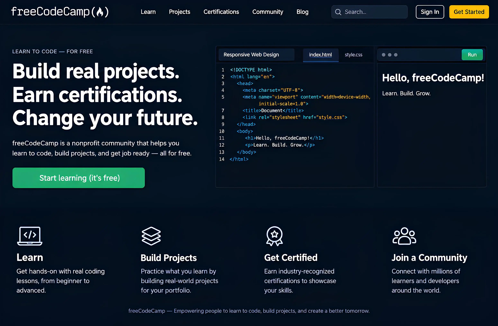

# 📁 FreeCodeCamp — Projetos Práticos

  

Este repositório reúne os **projetos práticos desenvolvidos por mim durante meus estudos e certificações na freeCodeCamp**.

O objetivo é registrar minha evolução técnica e colocar em prática os conhecimentos adquiridos ao longo da minha jornada rumo ao desenvolvimento **Full Stack JavaScript**.

---

## 🗺️ Mapa de Aprendizado e Tecnologias

| Módulo / Certificação             | Foco Principal                                              | Tecnologias e Conceitos                      |
| :-------------------------------- | :---------------------------------------------------------- | :------------------------------------------- |
| **1. Web Design Responsivo**      | Estrutura, estilização e criação de interfaces responsivas. | HTML5, CSS3, Flexbox, CSS Grid               |
| **2. JavaScript**                 | Lógica de programação, algoritmos e estruturas de dados.    | JavaScript, ES6+, POO, Programação Funcional |
| **3. Bibliotecas Front-End**      | Desenvolvimento de interfaces dinâmicas e componentizadas.  | React, Redux, Bootstrap, SASS, jQuery        |
| **4. Banco de Dados Relacionais** | Armazenamento, consultas e gerenciamento de dados.          | PostgreSQL, SQL, Bash, Git                   |
| **5. Back-End e APIs**            | Desenvolvimento de servidores, rotas e APIs.                | Node.js, Express, NPM, APIs REST             |

---

## 💻 Projetos

Os projetos deste repositório são desenvolvidos como parte prática do currículo da **freeCodeCamp**.

Cada projeto representa uma etapa do meu aprendizado e tem como objetivo transformar os conceitos estudados em **implementações práticas**.

---

## 📚 Objetivo do Repositório

Este repositório funciona como um registro da minha evolução durante os estudos, permitindo acompanhar meu progresso desde os fundamentos do desenvolvimento web até conceitos mais avançados de **Front-End, Back-End e Full Stack**.

Além de servir como material de estudo, os projetos também podem ser consultados por **recrutadores e outros desenvolvedores interessados em acompanhar minha evolução técnica**.

---

## 📄 Sobre os Projetos

Os projetos desenvolvidos especificamente para o currículo da **freeCodeCamp** seguem a proposta educacional da plataforma e estão organizados neste repositório para fins de estudo, prática e demonstração da minha evolução.

Projetos **autorais e comerciais** desenvolvidos independentemente do currículo da freeCodeCamp serão mantidos em repositórios próprios e estarão sujeitos às respectivas licenças e condições de uso.

---

  🚀 <strong>Estudando, construindo e evoluindo rumo ao desenvolvimento Full Stack.</strong>

